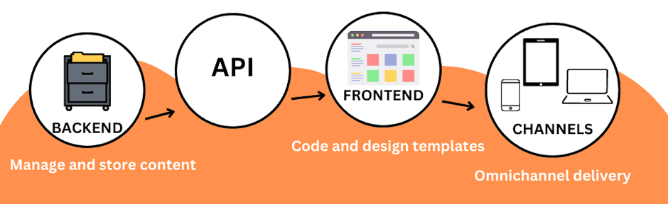
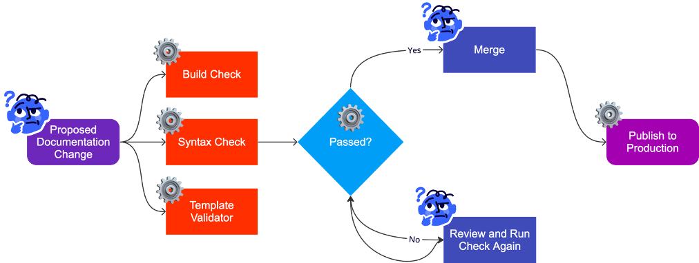
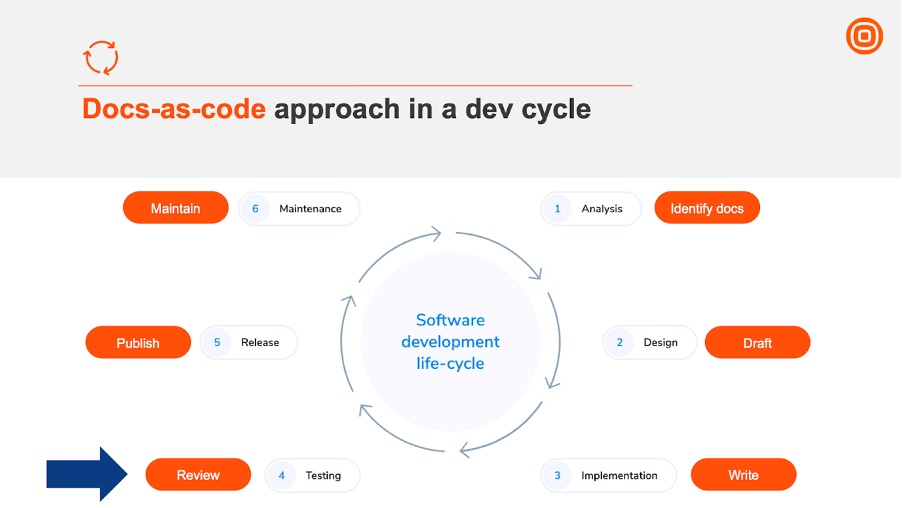

# Why Docs as Code Should be Part of Your Dev Cycle

Many established methods help streamline software development. However, the same cannot be said about documentation. Typically, a documentation cycle, as opposed to a developer one, is unnecessarily complicated, being a hybrid of different practices.

It's a process that most often only a documentation team knows how to navigate, with developers trying to avoid being part of it at all costs. Nobody wants to learn new tools and processes for a collaboration that does not seem to bring much value.

This article attempts to bridge the gap between documentation and development by showing the value of well-plannd documentation and outlining how developers and technical content creators can collaborate under one process that is efficient for both teams.

Because, let's face it, software documentation is important. It is often the very face of the product, like when it comes to an API reference. This is why documentation could and should be part of the development cycle, and Docs as Code is the way forward.

## What is a Docs as Code approach

As the name suggests, Docs as Code treats documentation as code, using the same tools and processes as software development to manage and publish documentation.

Before we delve deeper, let's go through key aspects of a Docs as Code approach to get familiar with the concept.

## Key aspects

The adoption of Docs as Code represents a paradigm shift in the way technical documentation is created and managed, making it an asset rather than a burden - a mindset many software companies develop around content.

It empowers developers to easily update and iterate on documentation, ensures its accuracy and relevant, and provides users with quality self-serve access to information when they need it most.

Many wins come with Docs as Code, but let's list those crucial for a developer cycle, the content iteself and collaboration between developers and content creators.

### Written in plain-text format

The most important aspect of the Docs as Code philosophy is **efficient collaboration between teams**. To cater to this need, documentation is typically stored in a plain-text format, most likely markdown.

This facilitates accessing, managing, and collaborating on any document. Plain-text format ensures you need no special equipment, software, or license to work on a document. Anybody with access to the repo where the document is stored can go in and contribute.

Styling is also abstracted from both writing and review process. Syntax review is typically automated by a linter and grammer checker, such as a markdown linting expansion plugged into your Visual Studio Code editor. There is no need for a human reviewer to spend time reviewing syntax. Their sole concern is **the content itself** and **the structure of the document**.

### Decoupled frontend and backend

The decoupled frontend and backend architecture is a key element of the Docs as Code practices as it separates the concerns of content creation and presentation.

This approach frees technical content creators from thinking about page design and styling of content elements (think warning notes, tips, tables, bullet points, etc.). They can focus solely on creating informative and well-structured content while collaborating with frontend developers or designers to provide an engaging and user-friendly presentation layer.

Content developers are free to deal with the most important aspects of content creation and management.

### Content structure

This is how to present information on a page.

- Sections needed for different types of content, such as a tutorial, will always start with a description of what a user will end up with once they complete all the steps.

- The structure of sections, for instance, a Prerequisites section, can be just in a bullet list, while an introduction section needs at least one paragraph to be considered valid for its purpose.

- The style of section titles. Is it camel case or like a sentence? Do we want to use gerunds or infinitives - "Sending an SMS with Python" or "Send an SMS with Python"?

### Content findability

This is how to present information within the context of an entire documentation site.

- Is the content easy to find by foraging through a documentation site, or is it impossible to find manually?

- How well does the search function work, and how do you optimize it for content findability? (Do we need better indexing, tags, filtering, etc.)

### Content resuability

This deals with which content can be reused across multiple guides and how we can best implement it in practice. It is especially important for companies that generate a lot of content that needs to be maintained and kept up to date with as little effort as possible.

### Information architecture

This is how to organize content into content buckets (for instance, which articles we need in a Getting Started bucket).

### User journey

This is how to navigate through content and link it in a logical way for a quality user experience.

As you can see, by adopting a decoupled frontend and backend approach, the technical content team can maximize their productivity and deliver high-quality content.

### Store content in a version control system

The Docs as Code approach embraces the practice of storing documentation in a version control system, leveraging a system the development team already uses.

It is important to highlight that the version control system needs to be git-based. A Docs as Code approach assumes that documentation should follow a similar workflow and versioning system as the codebase. By using a git-based product or a similar VCS, technical writers can branch, merge and track changes to the documentation just like developers do with their code.

This consistency in version control practices ensures that documentation evolves alongside the software, keeping it up to date and relevant.

### Use automated testing and development tools

The Docs as Code approach uses automated testing and deployment tools to streamline a documentation development and publication process.

It adopts a standard deployment process and uses something easily manageable to publish the docs from the source files, like a static site generator. That, together with automation tools running checks without the need for a human to do it manually, allows a documentation team to adhere to the principles of CI/CD, just like their developer colleagues.

It is a process that promotes efficiency and scalability, allowing teams to manage larger documentation projects without major hiccups.

### Go through a peer review

Having docs peer review sitting at the same level as code peer review, we make sure documentation is not treated any differently from code, making it harder to omit in the entire developer cycle.

One of the key advantages of a Docs as Code peer review is its seamless ability to incorporate feedback from multiple reviewers. Typically, a standard documentation review involves another technical author performing an editorial review and a review from a subject-matter expert, often a developer who worked on the feature.

This is fine for an initial handover, but it doesn’t provide an objective story. It’s like asking a parent to describe their child objectively. They can’t, because they created it, shaped it, put a lot of time and effort into its development and are very proud of it.

This is why inviting other stakeholders to the proverbial review table is important so they can pitch in their unique perspectives.

And just like that, a single-minded document suddenly becomes an exhaustive and user-inclusive experience. Moreover, such practice raises awareness. People now know where to look for more information to share with their customers. And since they’ve been involved personally, they feel pride and ownership, so they’re keener to share that knowledge.

## How to fit Docs as Code in a developer cycle

It requires careful planning and coordination between technical writers and development teams. It warrants a lot of openness and transparency so that all stakeholders can follow the most efficient process and practices, which depend greatly on the company’s resources.

When do we write docs? When do we review them? Let’s see how you can strap the entire documentation cycle to a developer one.

### 1. Analysis

When developers are in their planning phase, technical writers can already start planning as well. They would identify which existing documents need changes and see how much new content will be needed. At this stage, they can already give a rough estimate of the time they will need to create a complete set of documents needed for the feature in question.

By estimating the effort, the documentation team takes away the mysterious element of the “it will be ready when it’s ready” attitude and can commit to concrete deadlines based on their own estimates.

This practice protects both teams, the authors and the developers. The writers would never face a short and inhumane deadline anymore just because somebody remembered about documentation a couple of days before release day.

### 2. Design

During a design phase, technical writers can already start thinking about their own design — how they want to present information, what’s the ideal user journey, what type of content is needed, how to map it to the existing content.

### 3. Implementation

Once the feature is being implemented, technical authors can start writing. For obvious reasons, this phase will not align perfectly with the implementation one but rather start at the very end of it, most likely during the bug-bashing phase, in which the authors can participate themselves to get familiar with the feature.

### 4. Testing

Similar to developers, for technical writers, the testing phase is the time for last-minute improvements to their creations. That’s exactly when they would start inviting stakeholders for peer review and go through a review cycle with them. Since we’re propagating a Docs as Code approach, each document will have several reviewers and go through several review cycles simultaneously.

### 5. Release

Both documentation and code are released together on the same day. Since documentation hasn’t been treated as an afterthought and technical writers were there every step of the cycle, documentation is well-planned, well-thought out, comprehensive and written with a user in mind.

### 6. Maintenance

Again, documentation and code enter a maintenance phase together, and it looks similar for both. Anybody who spots an issue opens a ticket that’s triaged by a team, prioritized and resolved. Likewise, anybody who sees an opportunity for an improvement opens a pull request and contributes to either code or documentation.

## Key takeaways

Overall, adopting a Docs as Code approach and incorporating peer review as an integral part of the development cycle enhances the quality of technical documentation, improves collaboration between teams and ensures documentation is given the attention it deserves throughout the entire software development process.