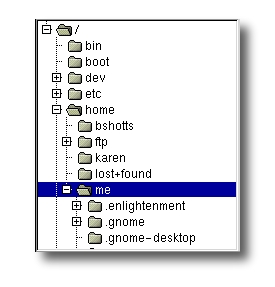
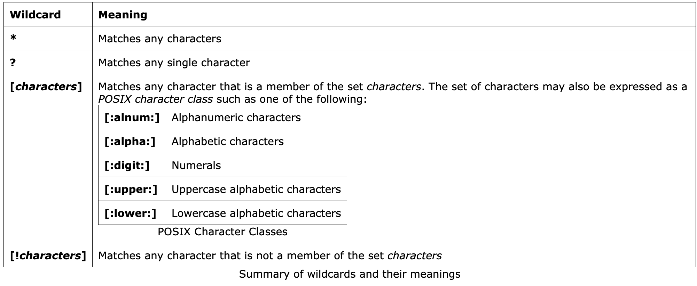

# Basics

## File System Organization

The files on a Linux system are arranged in what is called a *hierachical directory structure*. This means that they are organized in a tree-like pattern of *directories* (called folders in other systems), which may contain files and *subdirectories*.

The first directory in the file system is called the *root directory*. Often we will see the file system represented like this:



One important difference between Windows and Unix-like operating systems such as Linux is that Linux does not employ the concept of drive letters. While Windows drive letters split the file system into a series of different trees (one for each device), Linux always has a single tree. Different storage devices may be different branches of the tree, but there is always just a single tree.

Common commands used for navigation:

- `pwd`
- `ls`
- `cd`

Important facts about shortcuts and file names:

- If we type `cd` followed by nothing, `cd` will change the working directory to our home directory.
- Typing `cd -` changes the working directory to the previous one.
- File names that begin with a period character `.` are hidden. This means that `ls` will not list them unless we say `ls -a`.
- File names in Linux are case-sensitive. The file names `File1` and `file1` refer to different files.

## Looking Around

There are some tools that will come in handy during our journey.

- `ls` (list files and directories)
- `less` (view text files)
- `file` (classify a file's contents)

### `ls`

| Command           | Result                                                                                                                        |
|-------------------|-------------------------------------------------------------------------------------------------------------------------------|
| `ls`              | List the files in the working directory.                                                                                      |
| `ls /bin`         | List the files in the `/bin` directory (or any other directory we care to specify).                                           |
| `ls -l`           | List the files in the working directory in long format.                                                                       |
| `ls -l /etc /bin` | List the files in the `/etc` and `/bin` directories in long format.                                                           |
| `ls -la`          | List all files (even ones with names begining with a period character) in the parent of the working directory in long format. |

A closer look at long format:

```plain
-rw-------   1 me       me            576 Apr 17  2019 weather.txt
drwxr-xr-x   6 me       me           1024 Oct  9  2019 web_page
-rw-rw-r--   1 me       me         276480 Feb 11 20:41 web_site.tar
-rw-------   1 me       me           5743 Dec 16  2018 xmas_file.txt

----------     -------  -------  -------- ------------ -------------
    |             |        |         |         |             |
    |             |        |         |         |         File Name
    |             |        |         |         |
    |             |        |         |         +---  Modification Time
    |             |        |         |
    |             |        |         +-------------   Size (in bytes)
    |             |        |
    |             |        +-----------------------        Group
    |             |
    |             +--------------------------------        Owner
    |
    +----------------------------------------------   File Permissions
```

### `less`

Once started, `less` will display a file one page at a time. We can use the Page Up and Page Down keys to move through the text file. To exit `less`, we type `q`. Here are some commands that `less` will accept:

| Command            | Action                                                                          |
|--------------------|---------------------------------------------------------------------------------|
| Page Up or b       | Scroll back one page                                                            |
| Page Down or space | Scroll forward one page                                                         |
| G                  | Go to the end of the text file                                                  |
| 1G                 | Go to the beginning of the text file                                            |
| /*characters*      | Search forward in the text file for an occurrence of the specified *characters* |
| n                  | Repeat the previous search                                                      |
| h                  | Display a complete list less commands and options                               |
| q                  | Quit                                                                            |

### `file`

`file` will examine a file and tell us what kind of file it is.

| File Type                      | Description                                                   | Viewable as text?                |
|--------------------------------|---------------------------------------------------------------|----------------------------------|
| ASCII text                     | The name says it all                                          | yes                              |
| Bourne-Again shell script text | A bash script                                                 | yes                              |
| ELF 64-bit LSB executable      | An executable binary program                                  | no                               |
| ELF 64-bit LSB shared object   | A shared library                                              | no                               |
| GNU tar archive                | A tape archive file. A common way of storing groups of files. | no, use tar tvf to view listing. |
| gzip compressed data           | An archive compressed with gzip                               | no                               |
| HTML document text             | A web page                                                    | yes                              |
| JPEG image data                | A compressed JPEG image                                       | no                               |
| PostScript document text       | A PostScript file                                             | yes                              |
| Zip archive data               | An archive compressed with zip                                | no                               |

## A Guidied Tour to Directories

To view a list of directories, click [here](http://linuxcommand.org/lc3_lts0040.php).

## Manipulating Files

### Wildcards

Summary of wildcards and their meanings



For more info, see [Wildcard](http://linuxcommand.org/lc3_lts0050.php).

## I/O Redirection

As we have seen, many commands such as `ls` print their output on the display. This does not have to be the case, however. By using some special notations we can redirect the output of many commands to files, devices, and even to the input of other commands.

### Standard Output

To redirect standard output to a file, a ">" character is used like this:

```shell
ls > file_list.txt
```

To have the new results append to the file, use ">>" like this:

```shell
ls >> file_list.txt
```

### Standard Input

Many commands can accept input from a facility called standard input. By default, standard input gets its contents from the keyboard, but like standard output, it can be redirected. To redirect standard input from a file instead of the keyboard, the "<" character is used like this:

```shell
sort < file_list.txt
```

We could redirect standard output to another file like this:

```shell
sort < file_list.txt > sorted_file_list.txt
```

### Pipelines

With pipelines, the standard output of one command is fed into the standard input of another. Here is a very useful example:

```shell
ls -l | less
```

## File Permissions

The Unix-like operating systems, such as Linux differ from other computing systems in that they are not only multitasking but also multi-user.

To see the permission settings for a file, use `ls` command.

```shell
ls -l /bin/bash

# output
# -r-xr-xr-x  1 root  wheel  1296704 Jan  1  2020 /bin/bash
```

In the diagram below, we see how the first portion of the listing is interpreted. It consists of a character indicating the **file type**, followed by three sets of three characters that convey the reading, writing, and execution permission for the **owner**, **group**, and **everybody** else.


The `chmod` command is used to change the permission settings for a file or directory. To use it, we specify the desired permission settings and the file or files that we want to modify. In this example, we use octal notation to specify the permissions.

It is easy to think of the permission settings as a series of bits (which is how the computer thinks about them). Here's how it works:

```plain
rwx rwx rwx = 111 111 111
rw- rw- rw- = 110 110 110
rwx --- --- = 111 000 000

and so on...

rwx = 111 in binary = 7
rw- = 110 in binary = 6
r-x = 101 in binary = 5
r-- = 100 in binary = 4
```

For example, if we wanted to set `some_file` to have read and write permission for the owner, but wanted to keep the file private from others, we would:

```shell
chmod 600 some_file
```