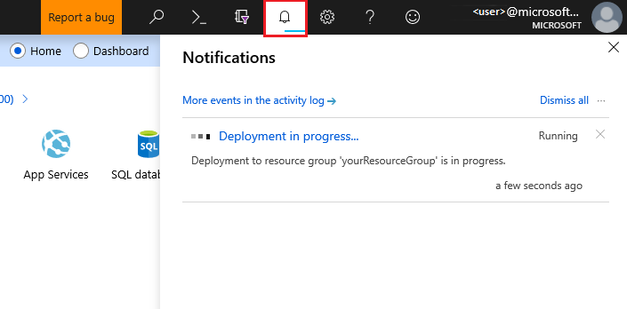

# Screenshots or not, for tech docs

Screenshots are a common and useful element in technical documentation. They can help readers visualize the interface, follow the steps, and verify the results of a task. However, screenshots also have some drawbacks, such as taking up space, requiring maintenance, and potentially revealing sensitive information. In this blog post, I will share some tips on when and how to capture screenshots for your technical documentation.

## When to capture

You should capture screenshots when they add value to your documentation. Some situations where screenshots are helpful are:

- When you introduce a new feature or concept that is not familiar to your audience.
- When you show a complex or important procedure that has multiple steps or options.
- When you illustrate a result or outcome that is not obvious or expected.
- When you compare or contrast different scenarios or alternatives.

## When not to capture

You should avoid taking screenshots when they are redundant, irrelevant, or distracting. Some situations where screenshots are not necessary are:

- When you describe a simple or common task that does not require visual guidance.
- When you repeat the same screenshot multiple times without any changes or annotations.
- When you include too many screenshots that clutter your page and make it hard to read.
- When you violate the privacy or security of your users or your organization.

Another situation where you’re better off without screenshots is attaching code samples. In such cases, it is often more effective to copy and paste the code directly into the document, rather than taking a screenshot of it.

## What to capture

The golden rule for creating quality screenshots is to capture the feature you’re showing, with a bit of context included. You should capture only the essential elements in your screenshots. That being said, you should find the balance between including the details that provide context to the screenshot and adding too many distracting elements.

Some guidelines for what to capture are:

- Crop your screenshots to show only the relevant parts of the interface. Remove any unnecessary menus, toolbars, icons, or windows.
- Focus on the action or result that you want to highlight. Use arrows, circles, boxes, or labels to draw attention to them.
- Use consistent sizes, resolutions, and formats for your screenshots. Follow the style and branding guidelines of your organization.
- Use high-quality images that are clear and legible. Avoid blurry, pixelated, or distorted screenshots.

Here's an example screenshot obtained from the [Azure SQL Database tutorial](https://learn.microsoft.com/en-us/azure/azure-sql/database/design-first-database-tutorial?view=azuresql). You can see that sensitive information such as the server name, admin, and password is replaced with placeholders.

!!! note

    Making the user zoom in on large screenshots is not the best user experience, so it’s better to make the spotlight of your screenshot immediately visible.

## What not to capture

You should avoid capturing any elements that are irrelevant, confusing, or harmful in your screenshots. For example, taking screenshots of your organization's internal information may lead to security breaches.

Some guidelines for what not to capture are:

- Do not include any personal or confidential information in your screenshots. This includes names, email addresses, phone numbers, passwords, credit card numbers, etc. If you cannot avoid capturing such information, use a tool to blur or mask it.
- Do not include any errors, warnings, or notifications in your screenshots. This includes pop-ups, alerts, messages, or indicators that may imply something is wrong or incomplete. If you cannot avoid capturing such elements, use a tool to remove or edit them.
- Do not include any outdated or inconsistent information in your screenshots. This includes dates, times, versions, languages, currencies, etc. If you cannot avoid capturing such information, use a tool to update or standardize it.

It’s best to keep names out of screenshots in publicly available technical documentation. Besides real personal names, you should also obscure the names of servers, domains, and network folders from your technical documentation screenshots.

Here's an example screenshot obtained from the [Azure SQL Database tutorial](https://learn.microsoft.com/en-us/azure/azure-sql/database/design-first-database-tutorial?view=azuresql). You can see that the surrounding elements are included in the screenshot, so that users can locate the feature.

!!! note

    If your product is prone to changes and requires a lot of technical documentation maintenance, you should keep in mind that screens that are volatile aren’t the best candidates for screenshots.

## What to highlight in screenshots

You should highlight the key points or benefits of your screenshots. Some ways to highlight them are:

- Use captions or titles to explain what your screenshots show and why they are important.
- Use colors or contrasts to emphasize the differences or similarities between your screenshots.
- Use animations or transitions to show the changes or progressions of your screenshots.
- Use stories or scenarios to provide context and relevance for your screenshots.

## Checklist for screenshots

Here are also some golden rules of thumb for screenshots usage in technical documentation:

- [x] **Size**: Make screenshots no larger than 600 pixels wide.
- [x] **Scope**: Limit the scope of a screenshot to just the portion of the UI that shows the action, plus enough surrounding details to help the user locate the item.
- [x] **Callouts**: Use only arrows and boxes for callouts.
- [x] **File name**: Create unique and meaningful file names to easily differentiate between screenshots, reflecting what has happened on the screenshots.
- [x] **Personal or private details**: Make sure to mask, modify, or remove any personal identifiers, passwords, logins, or other information that could compromise security.
- [x] **<alt> property**: Use the **<alt>** property to briefly describe the screenshot for visually-impaired readers.

<!-- Before you take a screenshot, ask yourself these questions:

- Is this screenshot necessary?
- Is this screenshot clear and accurate?
- Is this screenshot consistent and professional?
- Is this screenshot relevant and helpful?

After you take a screenshot, ask yourself these questions:

- Does this screenshot match the text and tone of my documentation?
- Does this screenshot comply with the privacy and security policies of my organization?
- Does this screenshot enhance the user experience and learning outcomes of my documentation? -->

By following these tips and checklists, you can create effective and engaging screenshots for your technical documentation.

Happy documenting!