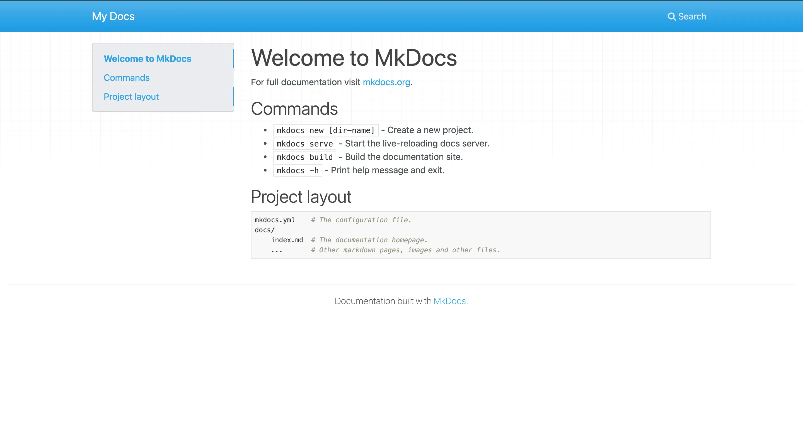

# Set up your personal blog in minutes

In this blog post, I'll show you how to set up a personal blog in minutes using [MkDocs](https://www.mkdocs.org/) and [GitHub Pages](https://docs.github.com/en/pages/getting-started-with-github-pages/creating-a-github-pages-site). MkDocs is a simple documentation generator, and GitHub Pages is a free hosting service that lets you publish your website directly from a GitHub repository. By combining these two tools, you can create a fully-functional personal blog that is easy to set up and customize. Follow along and learn how to set up your own personal blog in just a few minutes!

## Why a personal blog

Setting up a personal blog can be beneficial for a technical writer in several ways:

- **Establishing an online presence**: A personal blog can help a technical writer establish an online presence and showcase their expertise in a particular field. This can help them build a personal brand and attract potential clients or employers.

- **Demonstrating writing skills**: A personal blog can be a platform for a technical writer to showcase their writing skills. By writing regularly on their blog, they can demonstrate their ability to communicate complex technical information in a clear and concise manner.

- **Building a portfolio**: A personal blog can also serve as a portfolio of a technical writer's work. They can use their blog to showcase their writing samples, case studies, and other relevant work examples.

- **Sharing knowledge**: By sharing their knowledge and expertise on their personal blog, a technical writer can establish themselves as a thought leader in their field. This can help them build credibility and attract new clients or job opportunities.

- **Networking**: A personal blog can also be a way for a technical writer to network with others in their field. By engaging with their readers and other bloggers, they can build relationships and expand their professional network.

## Set up MkDocs

To use MkDocs, you need to install pip. You can find instructions on how to install pip [here](https://pip.pypa.io/en/stable/installation/). If you have pip, make sure to update it, and then install MkDocs. While you install MkDocs, you should also pick a theme (check out the options [here](https://github.com/mkdocs/mkdocs/wiki/MkDocs-Themes)). In the example, we picked the [mkdocs-material](https://github.com/squidfunk/mkdocs-material) theme.

Run the following code to install `pip`, `MkDocs` and theme `mkdocs-material`:

```shell
pip install --upgrade pip
pip install mkdocs
pip install mkdocs-material
```

Now you’re ready to create your documentation. Run the command below, but replace `PROJECT_NAME` with whatever your project name is:

```shell
mkdocs new PROJECT_NAME # Create a new MkDocs project
cd PROJECT_NAME # Redirect to the directory where the project is created
```

You should see a file named **mkdocs.yaml** and a folder named **docs**. The folder will have a single markdown file, that is, **index.md**.

To preview the docs layout, run `mkdocs serve` and then Point your browser to `http://127.0.0.1:8000/`. If everything's up, information similar to the following appears:



Then, open `mkdocs.yaml`, and you can see the following:

```shell
site_name: My Docs
```

We’re going to edit this file. First, we’ll create a generic outline; feel free to fill in the placeholder variables.

```yaml
site_name: NAME
nav:
  - Home: index.md
  - Page2: page2.md
  - Section1:
    - Subpage1: subpage1.md
    - Subpage2: subpage2.md
theme:
  name: THEME_DOWNLOADED
```

For example, assume that I want to set up a personal blog, sharing daily insights and showcasing writing samples. Then, this is what I would like to include in `mkdocs.yml`:

```yaml
site_name: My Blog
nav:
  - Home: index.md
  - About: about.md
  - Writing:
    - "Tech": writing/article1.md
    - "Rambling": writing/article2.md
  - Learn:
    - "Coding": learn/article1.md
    - "AI": learn/article2.md
theme:
  name: material
```

Note that all the folders and directories included in `mkdocs.yaml` must be in the `docs` directory. This is how my structure would look like:

```
PROJECT_NAME/
    docs/
        index.md
        about.md
        writing/
             article1.md
             article2.md
        learn/
             article1.md
             article2.md
    mkdocs.yaml
```

## Build your site

After all steps above are completed, you can use the following code to build a static site from Markdown files:

```shell
mkdocs build
```

Next, you can proceed to the next step, hosting the site on GitHub Pages.

## Lastly, deploy your site

To end, we’ll host our documentation on GitHub Pages. Simply run `mkdocs gh-deploy`. It should have created a new branch in your repository that will host your site at `USERNAME.github.io/REPOSITORY_NAME`.

If you want to learn more about MkDocs options, visit their [official website](https://www.mkdocs.org/).