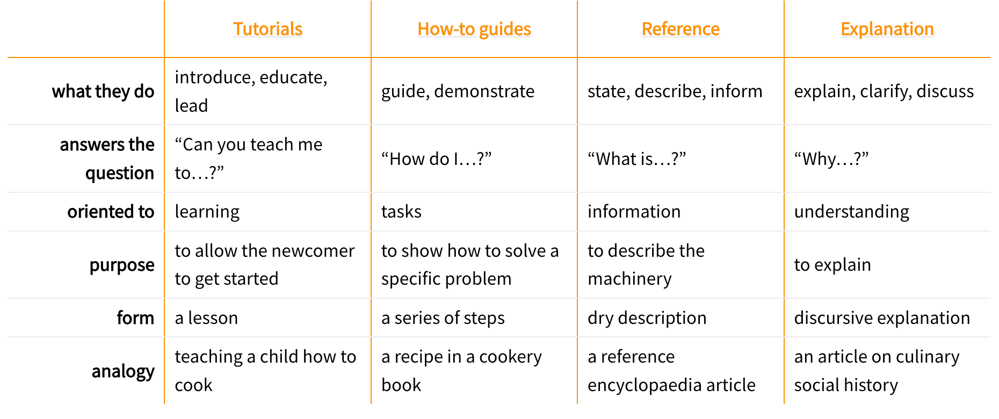
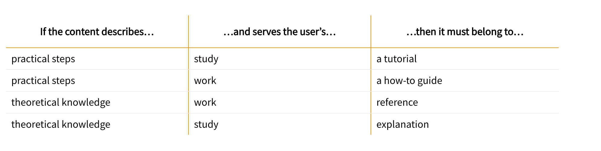

# Types of Docs

[Diátaxis](https://diataxis.fr/) identifies four modes of documentation - **tutorials**, **how-to guides**, **technical reference** and **explanation**. It derives its structure from the relationship between them.

In Diátaxis, each of these modes (or types) corresponds to a different user need. Each fulfils a different purpose and requires a different approach to its creation.

## Tutorials

Tutorials are **lessons** that take the reader by hand through a series of steps to complete a project of some kind. Tutorials must be **learning-oriented**.

A tutorial must help a beginner achieve basic competence with a product, so that they can go on to use the product for their own purpose.

A lesson entails a relationship between a teacher and a pupil. For documentation, a lesson is a learning experience. If you are not providing your learner with a learning experience, your tutorial is not doing the job it needs to.

### Write a Good Tutorial

There are some key aspects for writing a good tutorial:

- **Do not try to teach**. Allow the user to learn. Give your learner things to do, through which they can learn. As you lead the pupil through the steps you have devised, have them use the tools and perform the operations they'll need to become familiar with, building up from the simplest ones at the start to more complex ones.
- **Get the learner started**, not to turn them into an expert. Don’t ever be embarrassed to start right at the beginning: a user can skim rapidly over what’s unnecessary, but if they need something and it’s not there, you risk losing them altogether.
- **Provide a complete picture before they start**. Allow the learn to form an idea of what they will achieve right from the start.
- **Ensure that the tutorial works reliably**. One of your jobs as a tutor is to inspire the beginner's confidence. Confidence can only be built up layer by layer, but is easily shaken. The single most important requirement is that **what you ask the beginner to do must work**.
- **Ensure the user sees results immediately**. Your learner is probably doing new and strange things that they don't understand. Don't make them do too many before they see a result from their actions. As far as possible, the effect of every action should be clear to them as soon as possible. The relation of cause and effect should be evident.
- **Make your tutorial repeatable**. The users of your tutorial will have different levels of skill and understanding. They might also be using different tools and operating systems and you can't rely on them having the same resources or environment. This makes repeatable reliability extremely hard to achieve, and yet, **your tutorial should work for all users, every time**.
- **Describe concret steps, not abstract concepts or discussion**. All learning proceeds from the particular and concrete to the general and abstract.
- **Offer only minimum, necessary, explanation**. If the learner does not need an explanation in order to complete the tutorial, do not explain.
- **Ignore options and alternatives**. Your job is to guide the learner to a successful conclusion. There may be many diversions along the way, such as different options for the command, different ways to use the API, different approaches to the task you are describing - ignore them. Your guidance needs to remain focused on what's required to reach the conclusion, and everything else can be left for another time.

### Language of Tutorials

*In this tutorial, you will...*

*First, do x. Now do y. Now that you have done y, do z.*

*We must always do x before we do y because… (see Explanation for more details).*

*The output should look something like this...*

*Notice that... Remember that...*

*You have built a secure, three-layer hylomorphic stasis engine...*

## How-to Guides

How-to guides are **goal-oriented**, which can be thought of as recipes, directions that guide the reader through the steps to achieve a specific end.

The list of how-to guides in your documentation helps frame the picture of what your product can actually do. A rich list of how-to guides is an encouraging suggestion of a product's capabilities.

Consider a recipe, an excellent model for a how-to guide. A recipe clearly defines what will be achieved by following it, and addresses a specific question (How do I make...? or What can I make with...?).

Following a recipe **requires at least basic competence**. Someone who has never cooked before should not be expected to follow a recipe with success, so a recipe is not a substitute for a cooking lesson.

### Write a Good How-to Guide

There are some key aspects for writing a good how-to guide:

- **Describe a sequence of actions**. Unlike a tutorial, you don't have to start at the beginning of the whole story and take your reader right to the end. Most likely, your user will also be in the middle of something, so you only need to provide a starting point that they know how to reach, and a conclusion that actually answers a real question.
- **Solve a problem**. The problem or task is the concern of a how-to guide: **stick to that practical goal**. Anything else that's added - unnecessary explanation, for example, distracts both you and the user and dilutes the useful power of the guide.
- **Don't explain concepts**. An explanation doesn’t show you how to do something - so a how-to guide should not try to explain things. If explanations are important, link to them.
- **Omit the necessary**. In how-to guides, **practical usability is more helpful than completeness**. Whereas a tutorial needs to be a complete, end-to-end guide, a how-to guide does not. It should start and end in some reasonable, meaningful place, and require the reader to join it up to their own work.
- **Pay attention to naming**.
  - Good: How to integrate application performance monitoring
  - Bad: Integrating application performance monitoring (maybe the document is about how to decide whether you should, not about how to do it)
  - Very bad: Application performance monitoring (maybe it’s about how - but maybe it’s about whether, or even just an explanation of what it is)

### Language of How-to Guides

*This guide shows you how to...*

*If you want x, do y. To achieve w, do z.*

*Refer to the x reference guide for a full list of options.*

## Reference

Reference guides are technical descriptions of the machinery and how to operate it. Reference material is **information-oriented**.

The only purpose of a reference guide is to describe, as succinctly as possible, and in an orderly way. Whereas the content of tutorials and how-to guides are led by the needs of the user, **reference material is led by the product it describes**.

In the case of software, reference guides describe the software itself, APIs, classes, functions and so on - and how to use them.

Your users need reference material because they need truth and certainty. In the case of reference material, what you're seeking is information - accurate, up-to-date, comprehensive information.

### Write a Good Reference Guide

There are some key aspects for writing a good reference guide:

- **Respect the structure of the machinery**. The structure of reference documentation should mirror the structure of the product.
- **Be consistent**, in structure, language, terminology, tone.
- **Do nothing but describe**. Technical reference has one job: to describe, and to do that clearly, accurately and comprehensively. Doing anything else - explaining, discussing, instructing, speculating - gets in the way of that job, and makes it harder for the reader to find the information they need.
- **Provide examples**. Examples are valuable ways of providing illustration that helps readers understand reference, without becoming distracted from the job of describing.
- **Be accurate**. These descriptions must be accurate and kept up-to-date. Any discrepancy between the machinery and your description of it will inevitably lead a user astray.

### Language of Reference Guides

*X is an example of y. W needs to be initialised using z. This option does that.*
    State facts about the machinery and its behavior.

*Sub-commands are: a, b, c, d, e, f.*
    List commands, options, operations, features, flags, limitations, error messages, etc.

*You must use a. You must not apply b unless c. Never d.*
    Provide warnings where appropriate.

## Explanation

Explanation is **understanding-oriented**, which clarifies and illuminates a particular topic.

In the case of explanation, it’s useful to have a real or imagined why question to serve as a prompt. Otherwise, you simply have to draw some lines that mark out a reasonable area and be satisfied with that.

### Write Good Explanation

There are some key aspects for writing good explanation:

- **Make connections**. When writing explanation you are helping to weave a web of understanding for your readers. Make connections to other things, even to things outside the immediate topic, if that helps.
- **Provide context**. Provide background and context in your explanation: explain *why* things are so - design decisions, historical reasons, technical constraints - draw implications, mention specific examples.
- **Talk about the subject**. Explanation guides are about a topic in the sense that they are around it. Even the names of your explanation guides should reflect this; you should be able to place an implicit (or even explicit) about in front of each title. For example: About user authentication, or About database connection policies.
- **Discuss alternatives and opinions**. Explanation can consider alternatives, counter-examples or multiple different approaches to the same question. You’re not giving instruction or describing facts - you’re opening up the topic for consideration. It helps to think of explanation as discussion: discussions can even consider and weigh up contrary opinions.

### Language of Explanation

*The reason for x is because historically, y...*
    Explain.

*W is better than z, because...*
    Offer judgements and even opinions where appropriate..

*An x in system y is analogous to a w in system z. However, ...*
    Provide context that helps the reader.

*Some users prefer w (because z). This can be a good approach, but...*
    Weigh up alternatives.

*An x interacts with a y as follows:...*
    Unfold the machinery’s internal secrets, to help understand why something does what it does.

## Takeaways

The following table provides a summary of these doc types.

Compass for structuring documentation

